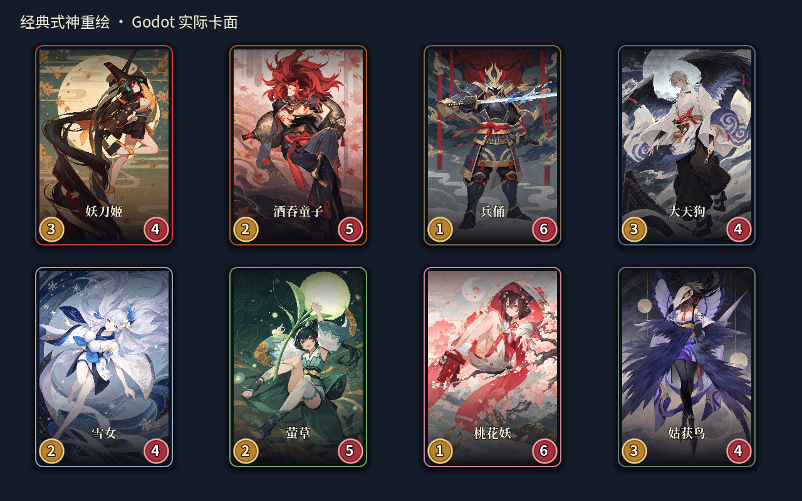
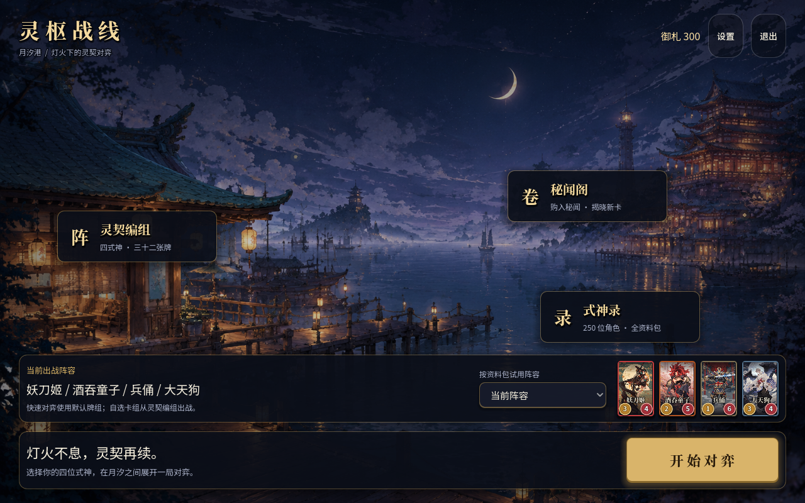
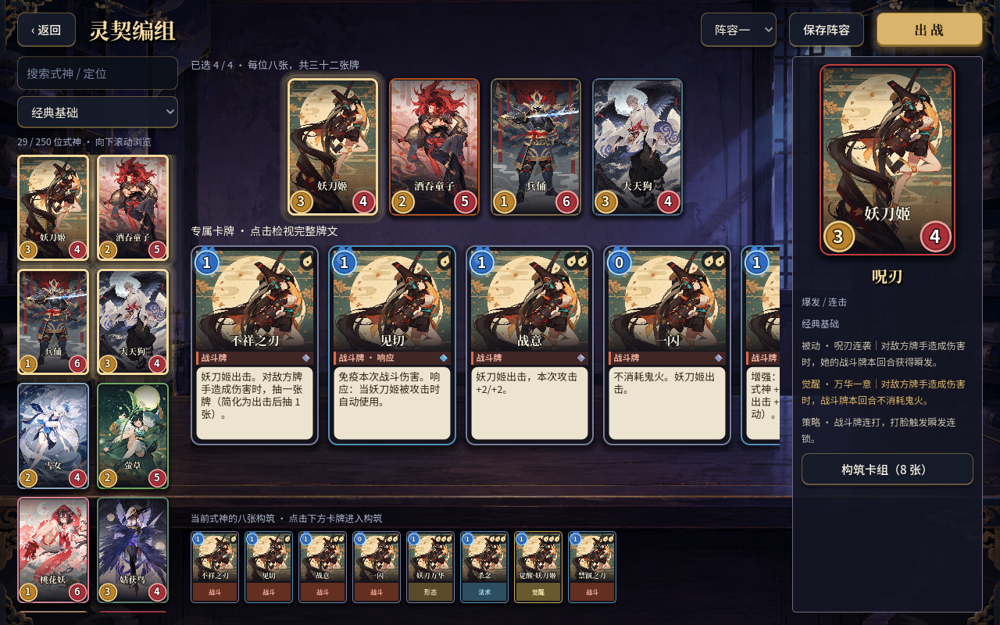
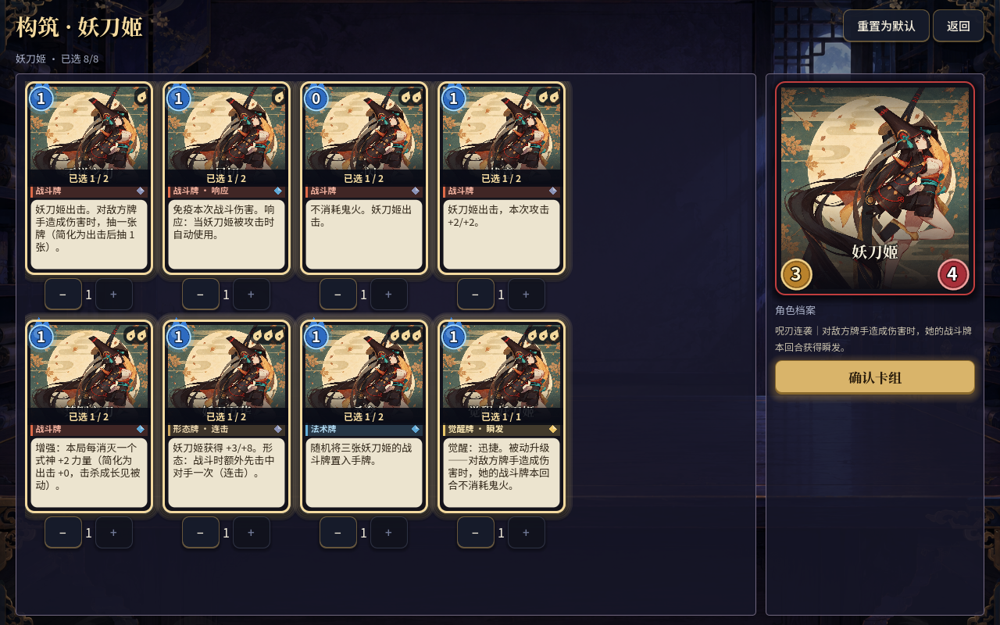
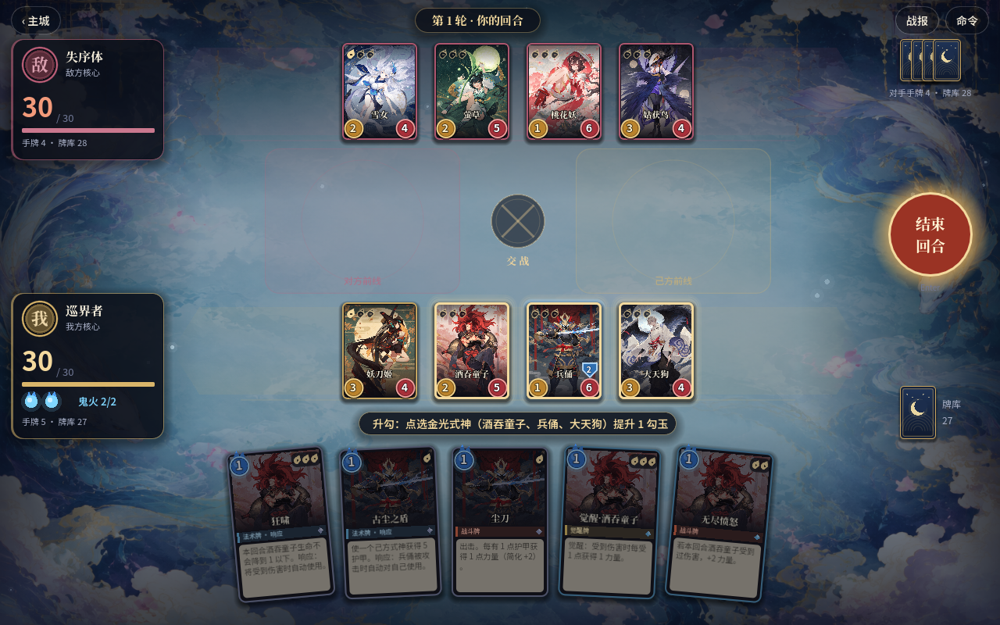
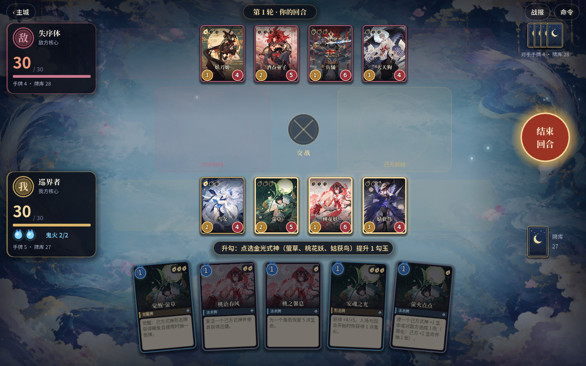

# Godot 经典角色重绘验收 · 2026-10-05

用户选择「参照原版角色和画风重新绘制」。本批完成经典名录前八位：妖刀姬、酒吞童子、兵俑、大天狗、雪女、萤草、桃花妖、姑获鸟。每张使用内置 `image_gen` 单独生成，输入为已查看的对应本地原版式神卡面，输出八张 1024×1536 PNG 无框插画，已复制进 `godot/assets/redrawn/classic/`，不依赖 Codex 私有生成目录。

## 美术与接入

- 保留各角色参考中的发型、服饰、武器、配色和主要轮廓，例如妖刀姬黑红甲胄与青绳、酒吞红发与酒葫芦、兵俑金冠与铠甲、大天狗白衣与黑羽、萤草蒲公英、姑获鸟鸟喙帽与羽衣。采用纸张纹理、平涂线描、装饰云纹和克制的金色细节。
- Godot 专用 `portraits.json` 映射角色 ID 与裁切焦点；`portrait_library.gd` 提供新图或现有 SVG 回退。所有 `CardFace` 入口共用新图，包含主城、编组、名录、卡组与战场，横向牌图按焦点裁切，保持比例。
- 普通与觉醒状态共用本批新图，觉醒边框仍单独显示；技能牌共用所属角色立绘。本批没有独立觉醒插画或每张技能牌的独立美术，其他 242 位角色仍使用既有占位资源。
- 保留既有 SVG 与浏览器内容导出；原版成品卡面只作输入参考，没有复制进 Godot。未改动角色数值或规则。完整提示词与来源见 [素材说明](../../godot/assets/redrawn/README.md) 和 [提示词集](../../godot/assets/redrawn/prompts.json)。

## 验证

`./scripts/godot-verify.sh` 返回退出码 0 和 `GODOT_VERIFY_ALL_OK`，日志没有 `ERROR`、`SCRIPT ERROR`、`WARNING` 或资源泄漏。详见 [verify.log](verify.log)。

| 检查 | 本次结果 |
| --- | --- |
| 资源导入 / 启动 / UI 脚本加载 | 通过，20 个 UI 脚本 |
| 重绘实际卡面、裁切范围/比例、角色归属、觉醒、缺图回退 | 173 项，0 失败，8 位新图 |
| 交互 / 参考流程 / 表现层 | 30 / 187 / 98 项，0 失败 |
| 存档与收藏 | 通过，使用隔离数据 |
| 全角色验证 | 5303 项，250 位全部可加载与出战；63 局覆盖全池 |
| 随机 / 定向对局 | 60 / 20 局全部完成，0 卡死 |
| `git diff --check` | 通过 |

`capture_redrawn.gd` 使用隔离存档，原生 Godot 1280×800 渲染六张图，返回 `REDRAWN_CAPTURE_DONE`。逐张查看了八位卡面、主城、编组、构筑以及两套阵容战场；新图可正常显示，窄肖像没有拉伸，卡牌裁切保留脸部，标签、攻血和勾玉由现有 UI 绘制。截图过程没有修改玩家数据。PNG 校验和见 [assets.sha256](assets.sha256)。

## 实际画面

本批为参考原版的生成重绘，细部仍有生成差异；没有声称为官方原画。复杂规则简化范围沿用 Godot README，本批资源加载与对局验收不等于所有官方技能已完整复刻。
