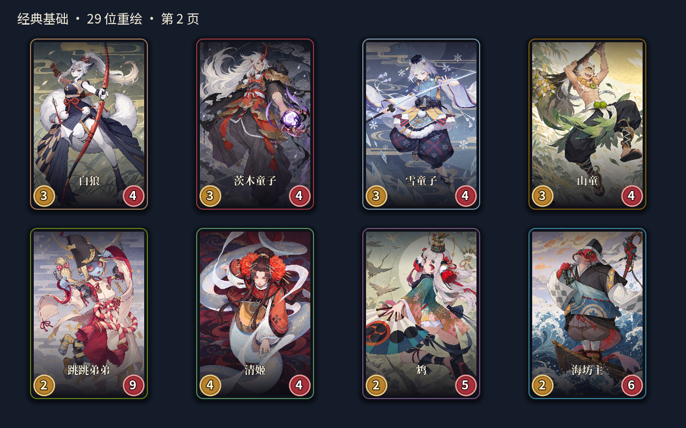
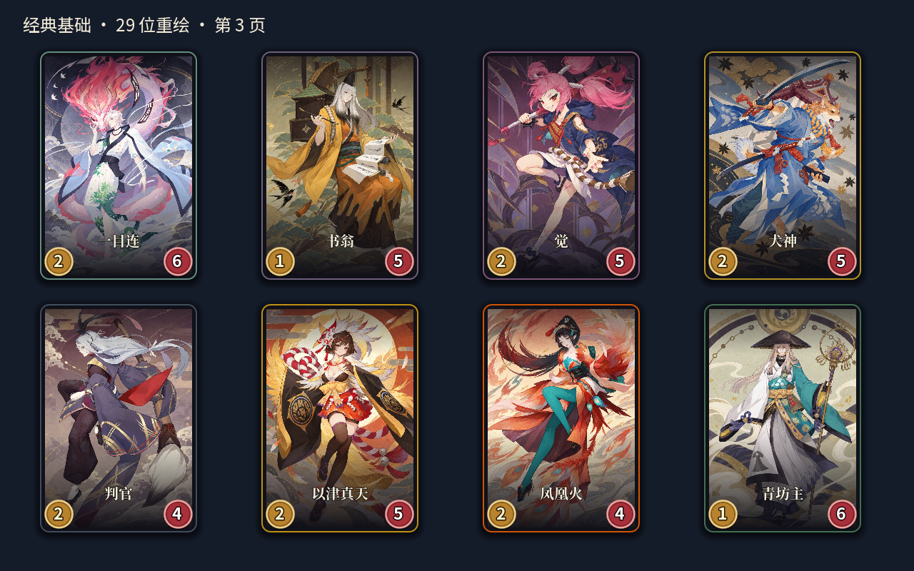
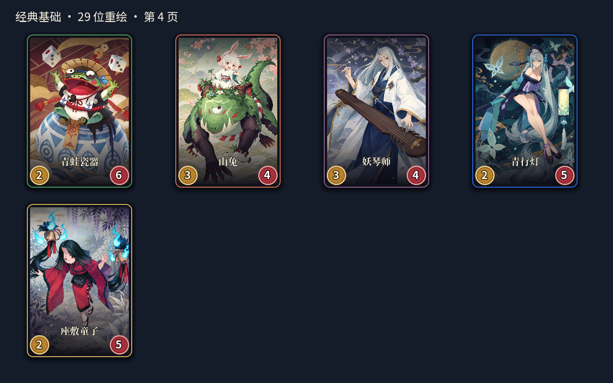
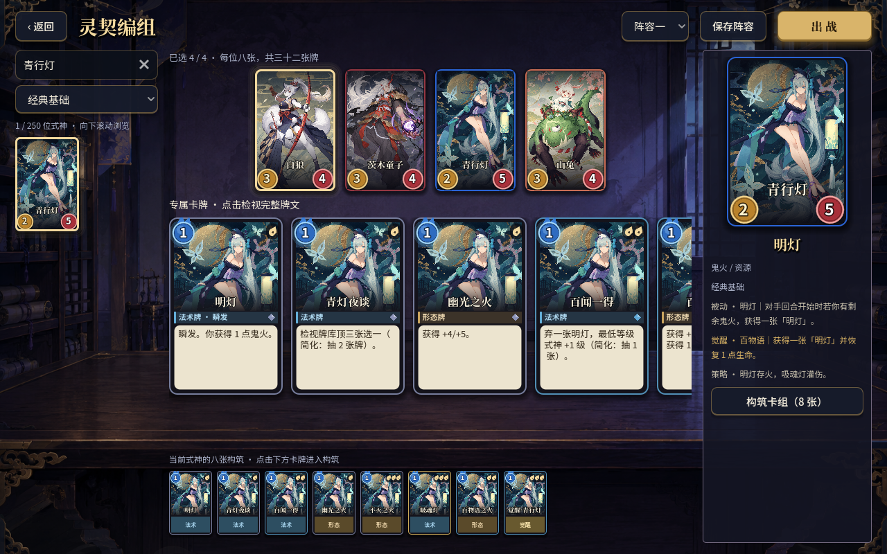
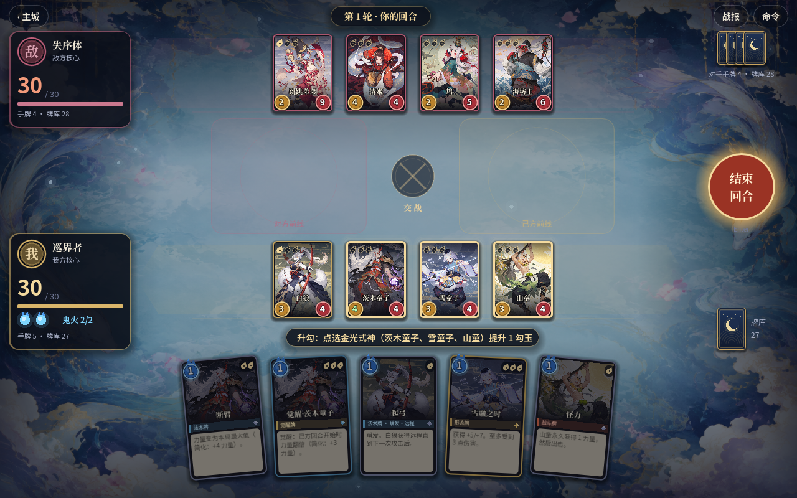

# Godot 完整经典包重绘与茨木童子修正 · 2026-10-05

延续「参照原版角色和画风重新绘制」的选择，完成经典基础包剩余 21 位，现共 29 位经典式神使用重绘 PNG。全部输入参考均已逐张查看；每位使用内置 `image_gen` 单独生成，保持对应的服饰、武器、配色、主要轮廓和纸纹绘画方向。所有最终文件均为 1024×1536 PNG，保存到 `godot/assets/redrawn/classic/`。

新增角色：白狼、茨木童子、雪童子、山童、跳跳弟弟、清姬、鸩、海坊主、一目连、书翁、觉、犬神、判官、以津真天、凤凰火、青坊主、青蛙瓷器、山兔、妖琴师、青行灯、座敷童子。其他资料包 221 位仍为原占位；普通与觉醒状态、所属技能牌共用本批角色立绘，没有新增独立觉醒或逐张技能牌插画。

## 茨木童子反馈修正

用户指出茨木童子第一版脸部问题，已重新生成清楚的五官和下颌，让白色发丝避开双眼、鼻口，同时保留服装、鬼手和背景。运行文件 `godot/assets/redrawn/classic/caitongzi.png` 使用修正版。通过二进制比较确认其与选中的修正版一致、与被拒绝的初版不同，结果见 [caitongzi-final-check.log](caitongzi-final-check.log)。

完整初始提示词、修正提示词、参考来源和最终输出路径见 [本批提示词集](../../godot/assets/redrawn/prompts-classic-completion.json)。第一批八张 PNG 的 SHA-256 仍全部与上批记录一致，本轮没有替换这些图片。全部 29 张的 SHA-256 见 [assets.sha256](assets.sha256)。原版成品卡面没有复制到 Godot，最终运行资产不依赖 Codex 私有生成目录。

## 接入与验证

扩充 `portraits.json` 为全部 29 位经典式神配置 PNG 与各自裁切焦点。现有主城、名录、编组、卡组和战场共用此映射；保留既有 SVG 和缺图回退。美术验收增加「经典包所有角色都有重绘」检查。截图脚本增加 `--full-classic`，逐页展示名录并在八组战场中覆盖每一位经典角色。

`./scripts/godot-verify.sh` 本次返回退出码 0 和 `GODOT_VERIFY_ALL_OK`，资源导入、日志均未出现 `ERROR`、`SCRIPT ERROR`、`WARNING` 或泄漏提示。详见 [verify.log](verify.log)。

| 检查 | 结果 |
| --- | --- |
| 完整经典包覆盖、真实卡面导入、归属、裁切范围/比例、觉醒、缺图回退 | 615 项，0 失败，29 位重绘 |
| UI 脚本加载 | 20 个，通过 |
| 实际交互 / 参考流程 / 表现层 | 30 / 187 / 98 项，0 失败 |
| 存档、收藏 | 通过，隔离数据 |
| 全角色加载、默认牌组与对局覆盖 | 5303 项，250 位，63 局覆盖全池 |
| 随机 / 定向对局 | 60 / 20 局全部完成，0 卡死 |
| 首批八张资源完整性 | 八张 SHA-256 全部匹配 |
| 茨木修正版文件核对 | 与修正版匹配，区别于拒绝初版 |
| `git diff --check` | 通过 |

原生 Godot 1280×800 渲染 15 张截图，返回 `REDRAWN_CAPTURE_DONE`，见 [capture.log](capture.log)。已逐张查看四页角色卡面、主城、编组、青行灯构筑与八组战场：29 位均可正常显示，人物和原版特征保留，卡面没有拉伸，牌图焦点和角色归属正确。截图使用隔离存档，未写入玩家阵容或收藏。

运行截图命令：

```sh
/Users/thysummer/apps/Godot.app/Contents/MacOS/Godot --path godot --script res://scripts/capture_redrawn.gd -- "$PWD/output/godot-art-classic-20261005/shots" --full-classic
```

## 新角色的实际卡面











其余截图：

- [经典包第一页](shots/01-classic-portraits-01.png) · [主城](shots/02-classic-menu.png) · [青行灯构筑](shots/04-qingxingdeng-deck.png)
- 战场 [1](shots/05-classic-battle-01.png) · [2](shots/05-classic-battle-02.png) · [4](shots/05-classic-battle-04.png) · [5](shots/05-classic-battle-05.png) · [6](shots/05-classic-battle-06.png) · [7](shots/05-classic-battle-07.png) · [8](shots/05-classic-battle-08.png)

本批为参考原版的生成重绘，细部仍有生成差异。美术与可出战验收不等于所有官方技能已完整复刻，复杂规则的简化范围仍以 Godot README 为准。
