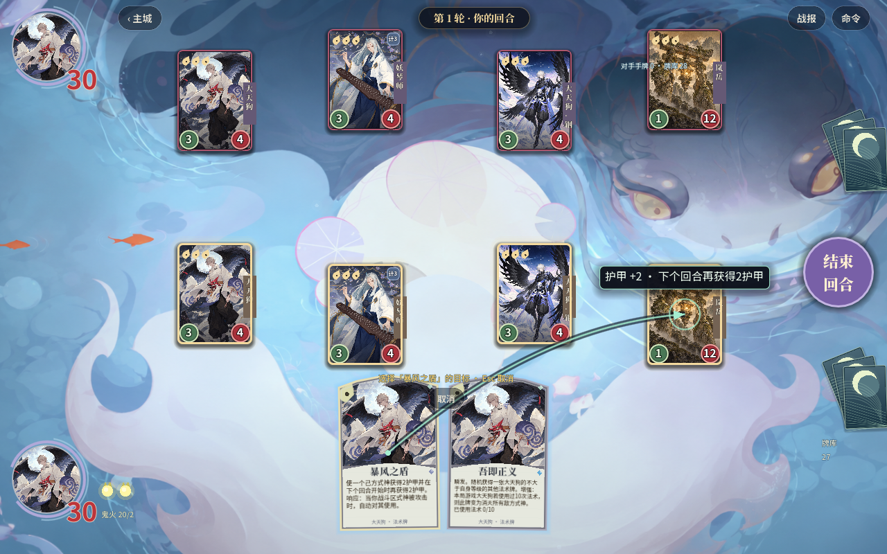
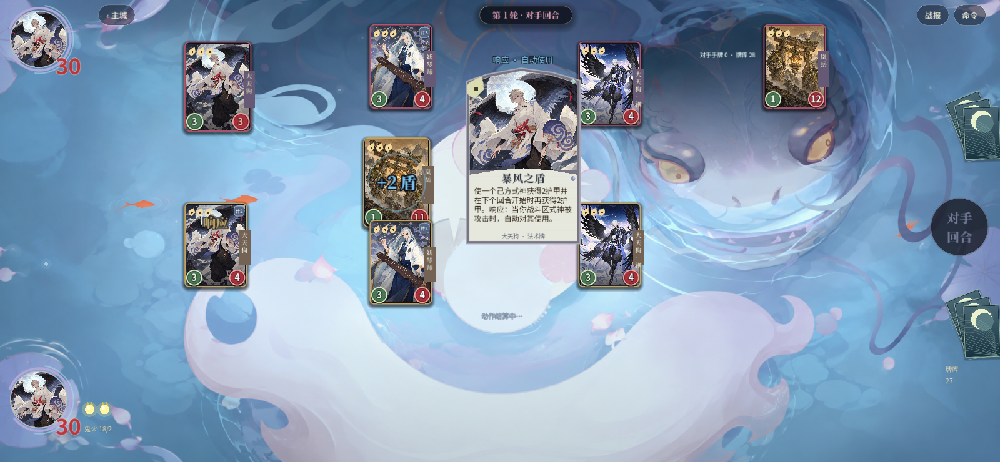
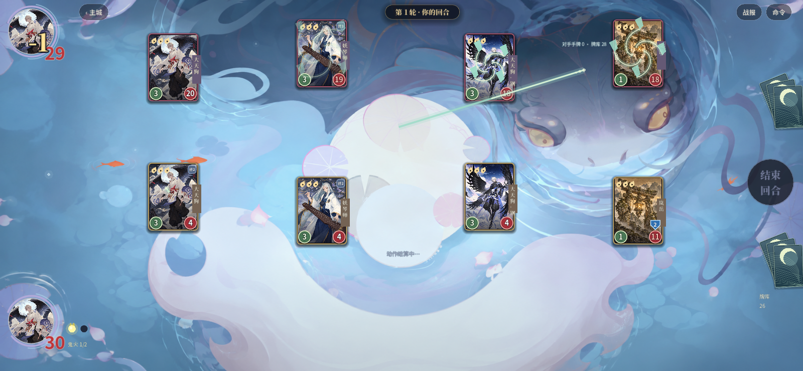

# 大天狗续建验收 · 2026-10-06

本地 Godot 已替换大天狗基础能力、8 张专属牌及天狗风乱异画的历史近似逻辑。法术保留、倒计时复用、觉醒缩短周期、六次随机命中、形态去重追加伤害、吾即正义按施法记录增强、随机取牌和直接消灭、暴风之盾延迟护甲及攻击前自动响应均进入实际执行器。同步完成目标提示、动态手牌、式神检视、逐发风刃、响应先于冲击和消灭独立表现。

同时纠正上一轮倒计时被魔音反制的判定，以及被反制的钢风战斗牌未保留起源倒计时的问题。修改了对应回归预期，来源及版本冲突见 [研究记录](../../research-notes/11-datiangou-spell-replay.md)。未同步旧 JS 卡库、未发布网页、未提交或推送。

| 检查 | 结果 | 证据 |
| --- | --- | --- |
| 大天狗规则 | 115 检查通过 | [最终规则日志](rules-final.log) |
| 原生鼠标交互 | 1280×800、1600×740 共 38 检查通过 | [最终窗口日志](ui-native-final.log) |
| 完整 Godot 验收 | `GODOT_VERIFY_ALL_OK`；63 场角色覆盖 + 60 普通对局 + 20 专项对局全部结束，无卡死 | [完整日志](full-verify.log) |
| 联动回归 | 钢风 115、妖琴师 126 检查通过 | 完整日志与 [妖琴师日志](yaoginshi.log) |
| 最后演出调整复测 | 120 演出、97 法术检查通过 | [演出](verify_presentation-final.log)、[法术](verify_spell_effects-final.log) |
| JS 回归 | 164 通过、0 失败 | [日志](node-tests.log) |
| UI 静态审计 | 385 检查、0 错误 | [日志](audit.log) |
| 全库规则审计 | **未通过：全库还原尚未完成** | [摘要](rule-fidelity.log)、[逐条清单](rule-fidelity.json) |
| 工作区差异格式 | `git diff --check` 通过 | 本轮终端检查 |

完整验收时大天狗原生交互为36项；随后补充“直接消灭不显示虚构伤害”的两项断言，并让目标截图等待连线完成绘制。最终原生38项、相关演出与法术回归重新运行通过；规则执行器没有在完整验收之后变更。所有最终日志均检查了 `SCRIPT ERROR:` 和 `ERROR:`，不只依赖进程退出码。

**这不是全库效果与原版完全相同的证明。** 当前3个角色、25张牌有资料支持的原生实现；154个角色能力、1074张牌仍有明确近似标记，93个角色、1015张牌尚未逐条核对。暴风之盾“下个回合”的精确阶段、多张同名盾的同时响应、反制施法是否计入吾即正义等仍需原版实机确认。具体实现选择和证据边界保留在研究记录，没有把这些未确认项冒充已验证。

## 原生截图

目标提示展示即时与下一回合两份护甲：

响应大卡与护甲反馈先于攻击冲击：

逐发风刃使用真实随机目标：

