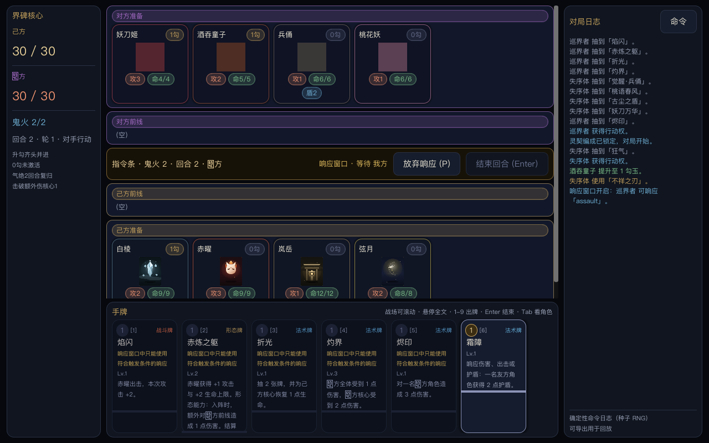

# Godot 修复验收 · 2026-10-03

Godot 已包含菜单、编成、构筑、图鉴、秘闻阁、战斗与结果流程，本次实际读取 250 式神 / 2114 卡。浏览器规则保留为对拍基准。本轮改动集中在实际操作、响应优先权、确定性记录和收藏经济，没有增加依赖。

## 修复结果

| 问题 | 修复后的行为 |
| --- | --- |
| 点击角色报 `Expected 3 argument(s)`，升勾/出击入口失效 | 按钮传入角色与绑定的玩家/索引，实际按钮信号可升勾、选响应目标 |
| 指定目标的响应牌无法打开窗口 | 检查合法目标后判定响应可用性，霜障可在对手回合响应 |
| UI 用当前回合调度响应，AI 会替玩家放弃响应或选择占卜 | 规则层统一返回当前行动方，AI 仅操作自己，玩家的选择保持待处理 |
| 结束回合后保留旧手牌索引；UI 额外强制升勾 | 状态变化清除选目标，结束回合条件与规则层一致 |
| 编成往返构筑页丢失未确认阵容 | 返回及保存卡组均保留编成草稿 |
| 快速对战也读取自定义构筑，对手套用玩家的同名角色卡组 | 快速对战和对手使用默认卡组，编成对战保留玩家自定义卡组 |
| 命令记录将响应者写成当前回合玩家，占卜选择缺失 | 命令记录实际行动方与具体占卜选择 |
| 随机被动调用全局 RNG，战报超过 400 条后丢弃最新消息 | 被动统一消耗对局种子 RNG，战报滚动保留最新 400 条 |
| 双方前线挤掉手牌，状态和指令撑宽布局，界面切换后缩小 | 战场滚动、手牌保留在窗口内、徽章和指令换行、屏幕锚点与偏移一起设置 |
| 编成长文本撑宽详情栏，浅色页面部分正文难读 | 被动在栏内换行，图鉴/构筑/收藏使用宣纸主题的文字颜色 |
| Godot 保底按每张卡累计，与网页按包规则不同 | 按包累计，SSR 重置两种保底，v1 存档换算为 v2 的完整包数并保留御札/收藏 |
| 原验收遗漏真实交互，测试写入玩家存档，压测容忍部分卡死 | 综合入口加入交互回归、临时存档、严格失败检查，任一卡死即失败 |

初始交互复现为 16 项检查中的 12 项失败，收藏保底复现为 6 项失败。本轮补齐回归覆盖后，30 项交互/规则/布局检查与 9 项经济/存档迁移检查均通过。

## 本次执行结果

| 检查 | 结果 / 证据 |
| --- | --- |
| `npm test` | 163 通过、0 失败；[日志](web-tests.log) |
| `npm run audit` | 385 检查、0 错误；[日志](web-audit.log) |
| `./scripts/godot-verify.sh` | `GODOT_VERIFY_ALL_OK`；包含内容、12 个 UI 脚本、存档、收藏、30 项交互回归、60 局随机与 20 局固定阵容、启动冒烟；[日志](godot-verify.log) |
| 扩展 AI 压测 | 本轮另执行 100 局随机与 32 局固定阵容，均有胜负、零卡死；结果见本次聊天工具记录 |
| JS / Godot 对拍 | 原有 6 样本与新增指定目标响应样本逐步/最终快照一致；[汇总](parity-summary.json) |
| 原生渲染 | 本机 Godot `4.8.dev5.official.9552dfb68`、Compatibility，1280×800；10 张截图，`CAPTURE_DONE`；[日志](capture.log) |
| `bash -n scripts/godot-verify.sh scripts/godot-parity.sh` / `git diff --check` | 通过 |

对拍成功命令数：占卜 5/5、运势 5/5、响应放弃 8/8、响应连锁 8/8、新增指定目标响应 4/4；旧核心环样本为 10/16，旧关键词样本为 5/13。后两者含未执行成功的命令，当前对拍证据只覆盖各样本实际执行到的状态。

验证存档、收藏及截图使用独立临时目录，完成后清理；真实玩家存档路径保持默认。v1 收藏换算只在实际加载旧收藏时执行，并已验证重复加载不会再次换算。

## 渲染复查

[菜单](01-menu.png)、[编成](02-formation.png)、[构筑](03-deck.png)、[图鉴](04-codex.png)、[秘闻阁](05-collection.png)、[开局](06-battle.png)、[双方前线](06b-front-lines.png)、[响应窗口](06c-response.png)、[占卜](06d-divination.png)、[结果](07-result.png)。

布局使用 Godot 的 [ScrollContainer](https://docs.godotengine.org/en/stable/classes/class_scrollcontainer.html)、[FlowContainer](https://docs.godotengine.org/en/stable/classes/class_flowcontainer.html)，全屏节点同时设置 [Control anchors 与 offsets](https://docs.godotengine.org/en/stable/classes/class_control.html#class-control-method-set-anchors-and-offsets-preset)。

## 当前迁移边界

烹饪、入夜、蓄力等复杂资源链及部分被动仍有简化或未实现效果；Godot 的命令页和结果页展示日志摘要，完整存档重放界面尚未接入。当前 7 组对拍尚不足以覆盖全库规则。本轮验证了桌面原生渲染、按钮信号、AI 定时调度与头部逻辑，没有验证移动设备触控或导出安装包。

工作区原有的 `godot/project.godot` 改动和 `.uid` 文件保留；本轮未提交或推送。
