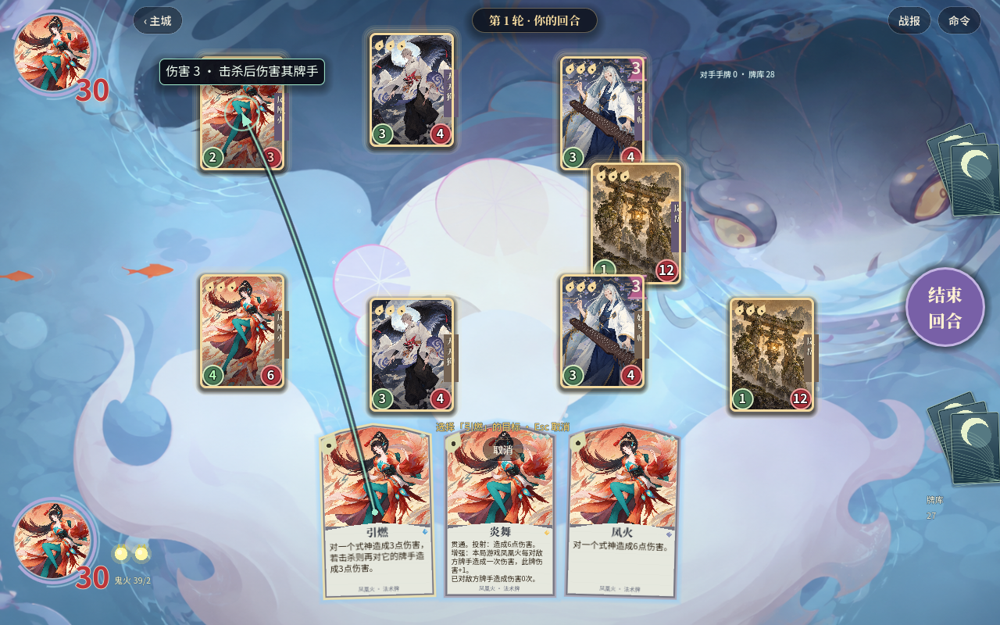
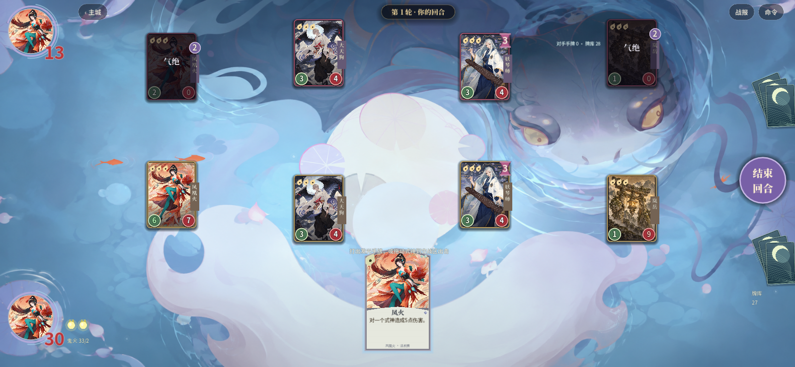

# 凤凰火并行重建验收

本轮仅重建 Godot 原版凤凰火基础能力与 `c12401–c12408`，由独立 `phoenix_rules.gd` 承担规则，主代理集中接入共享引擎、目标系统、AI 和演出。未修改旧 HTML/JS 角色映射，未关闭任何角色入口。

## 已完成的实际行为

使用法术时记录独立能力帧，本体之后结算投射；凤火/引燃使自己气绝后仍投射，符合原作者实测；觉醒后响应队友法术；焚羽按每段非战斗伤害加值而不影响普通攻击；引燃严格根据本体是否击杀判断第二段，并指向目标所属牌手；出云实际掷六面骰生成凤火；炎舞统计凤凰火整局对敌方牌手的实际伤害事件，包括普通攻击，并按贯通结算过量伤害。式神屏障不再连带阻止牌手的贯通份额。

凤火、引燃可以选择双方存活式神；AI 避免误伤友军并识别击杀收益、增强贯通斩杀和 1 血不屈目标。手牌与瞄准显示焚羽后的伤害，炎舞显示累计命中次数。独立投射保留能力演出事件，运势显示实际骰子结果。

## 检查结果

| 检查 | 本次结果 | 证据 |
| --- | --- | --- |
| 接入前最小复现 | 76 项，35 项失败；缺失机制产生 2 处字段错误 | `baseline.log` |
| 凤凰火结算、边界与 AI | 122 项，0 失败，干净退出 | `rules.log` |
| 两分辨率 headless UI | 57 项，0 失败，干净退出 | `ui-headless.log` |
| 两分辨率 native UI | 57 项，0 失败；退出码 0；verbose 日志无错误、资源或对象泄漏告警 | `ui-native-verbose.log` |
| 原生截图 | 16 张，1280×800 / 1600×740 | `native-shots/` |

本分支没有独立运行全库压测，由主代理在三个并行角色合并后统一运行。各专项通过不意味着全卡库已按原版还原。

## 原生截图

每种分辨率均覆盖 8 个节点：引燃瞄准、炎舞动态增强、贯通结果、友方目标、觉醒后队友施法、出云生成凤火、魔音反制后独立投射、自身气绝后保留投射。

本次原生运行后重新目视核查以上两图与两种分辨率的反制截图：目标线、牌面文字、实际伤害、生成的凤火与战斗/准备区布局可读。首次复验发现“法术无效”与“运势 2·失败”短时提示局部重叠，主代理将运势反馈下移后，已重新运行完整原生检查并目视核查 `1280-07-countered-spell.png` 和 `1600-07-countered-spell.png`，两条提示现在分开显示。用户视频 06:50 仅作为布局及交互参照，没有把未出现的规则当成录像已证明。

## 仍需核验

`verified_rules.json` 在凤凰火基础能力与凤鸣、炎舞、出云三张卡上保留 `verificationPending`。具体包括凤鸣 2020 维护记录 2 点与快照 3 点的版本冲突、魔音反制后与响应变形的使用触发边界、焚羽在气绝前后是否快照加伤、屏障叠加护甲/破甲及转换时的贯通细节、出云在反制/本体气绝后、同次施法顺序与其他式神改骰组合。当前使用事件独立保留的模型有程序正反例，反制/出云待核验边界不因测试通过而标为已证实。来源与当前模型见 [研究笔记](../../research-notes/14-phoenix-rules.md)。

上轮原生退出告警定位为 `SfxHub` 尚在播放的 `AudioStreamWAV` / `AudioStreamPlaybackWAV`；只在测试 teardown 增加正常停止、解除 stream、清空静态引用、释放播放器节点及等待音频线程回收。完整交互过程仍正常播放音效，没有静音跳过验证。本次 headless 与 native 复验均干净退出；原生 verbose 全文检索 `ERROR`、`WARNING`、`Leaked`、`still in use`、`unclaimed` 均无命中。此结论只针对本测试退出路径，不泛称所有应用退出场景都已验证。
