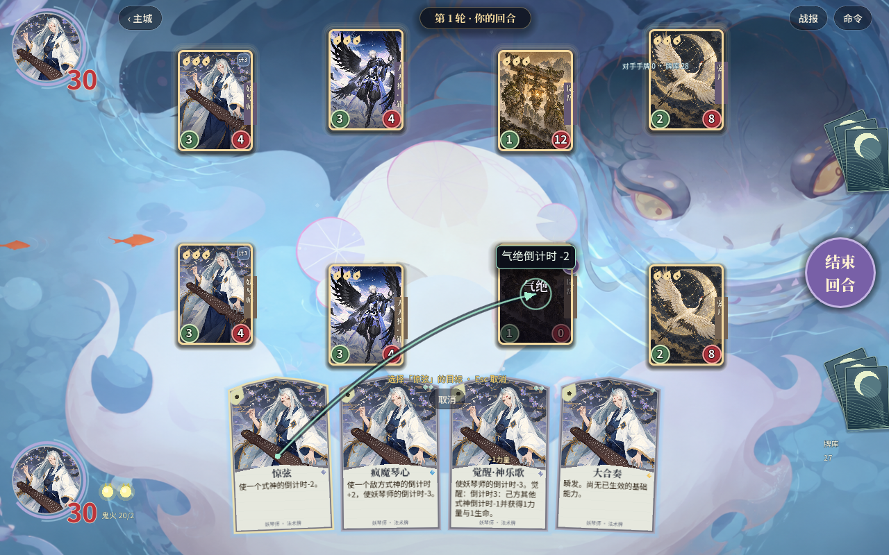
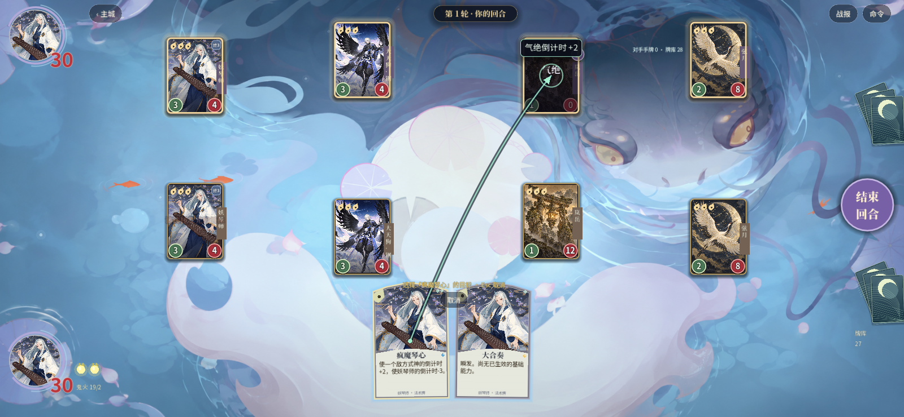
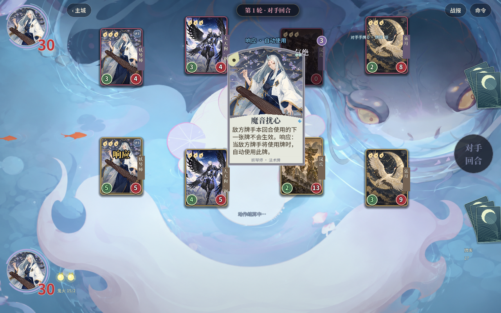

# 妖琴师续建验收 · 2026-10-06

本地 Godot 已替换妖琴师基础能力和 8 张牌的旧近似执行路径：独立能力倒计时、三觉醒切换、双方气绝目标、神乐歌与余音分段连锁、魔音自动反制、大合奏真实触发历史。牌型、稀有度与觉醒属性标记同步修正；手牌动态牌文、角色检视、目标提示、响应大卡和演出锁同步接通。

**这不是全库还原完成证明。** 新版入阵歌的觉醒监听时序、大合奏多种能力的执行顺序，以及被反制施法与其他角色监听的关系，还需要原版实机确认。当前实现和证据边界详见 [研究记录](../../research-notes/10-yaoginshi-countdown-rules.md)。旧 JS 未同步，网页未发布，没有提交或推送。

## 验证

| 检查 | 结果 | 证据 |
| --- | --- | --- |
| 妖琴师规则 | 125 检查通过 | [最终规则日志](rules-final.log) |
| 原生鼠标交互 | 1280×800、1600×740 共 30 检查通过 | [最终窗口日志](ui-native-final.log) |
| 完整 Godot 验收 | `GODOT_VERIFY_ALL_OK`；250 角色、63 角色覆盖对局 + 60 普通对局 + 20 专项对局全部结束，无卡死 | [完整日志](full-verify.log) |
| 最后演出调整复测 | 120 演出检查、97 法术效果检查通过 | [演出](presentation-final.log)、[法术](spell-final.log) |
| JS 回归 | 164 测试通过 | [日志](node-tests.log) |
| UI 静态审计 | 385 检查、0 错误 | [日志](audit.log) |
| 全库规则审计 | **未通过，符合当前未完成事实** | [摘要](rule-fidelity.log)、[逐条清单](rule-fidelity.json) |

完整 Godot 验收时新增规则/交互检查分别为 121/28；随后补充了能力不触发卡牌响应、自动起源可被反制、大卡可读性检查，并修正自动反制标题和觉醒属性显示，最终专项检查为 125/30。最后演出改动另跑了相关回归，没有把早期截图当作最后效果。

当前全库仍有 155 个角色能力、1078 张牌带明确近似标记，另有 93 个角色和 1020 张牌未逐条核对。2 个角色、16 张牌的 `source-backed-native` 只表示有资料与原生实现，未解决的实机边界仍在研究记录中。

## 原生截图

气绝友方可被惊弦选中，目标连线显示实际减少值：

疯魔琴心延后敌方式神复活，不再冻结敌方全队：

留有鬼火与魔音时自动响应，不弹出手动响应窗口：

