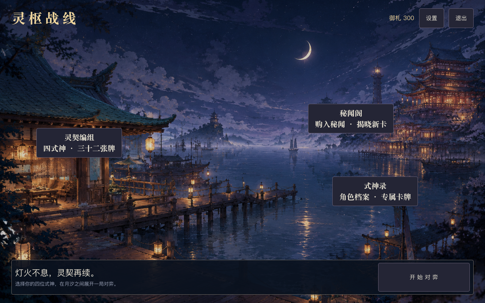
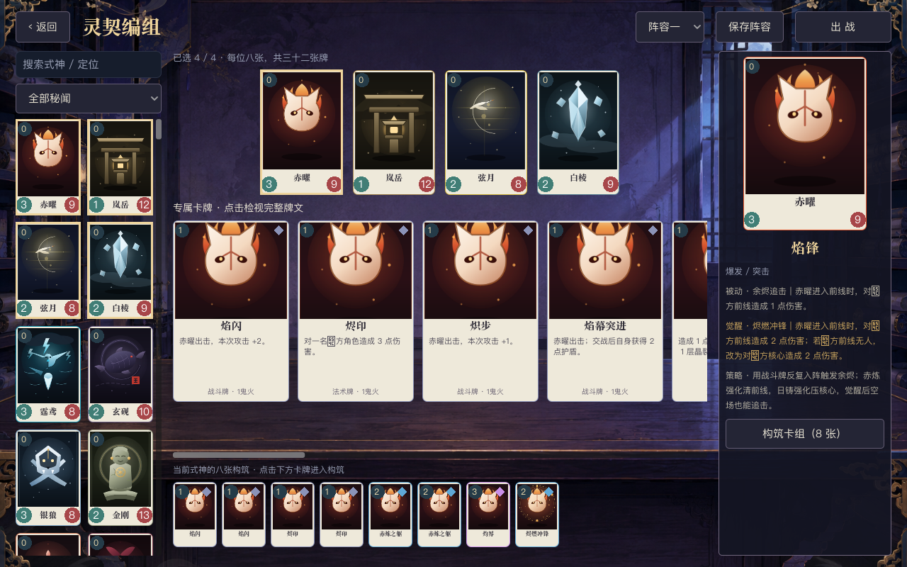
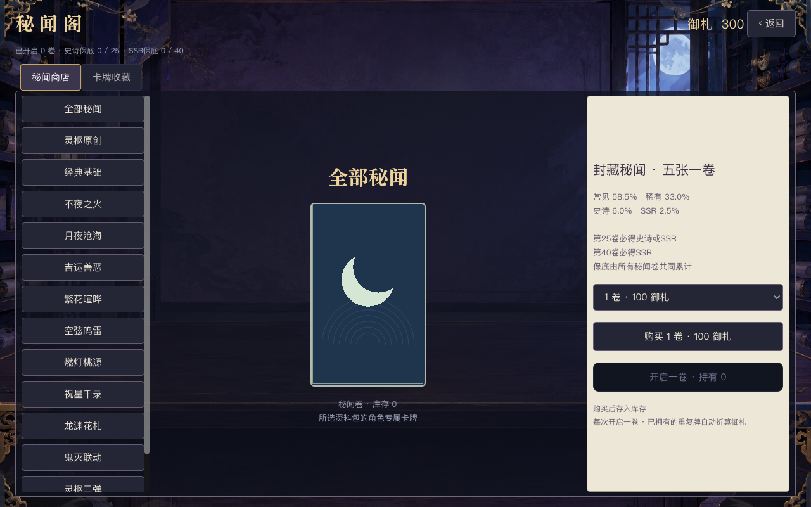
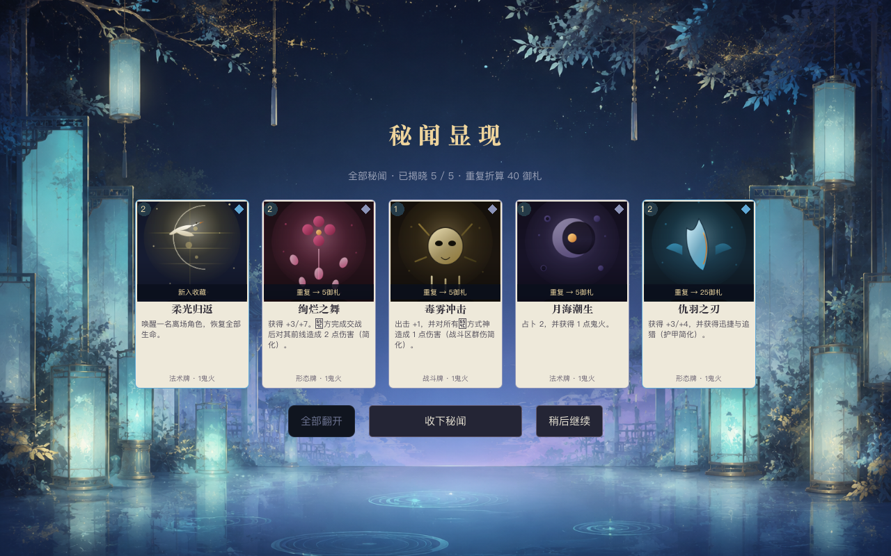
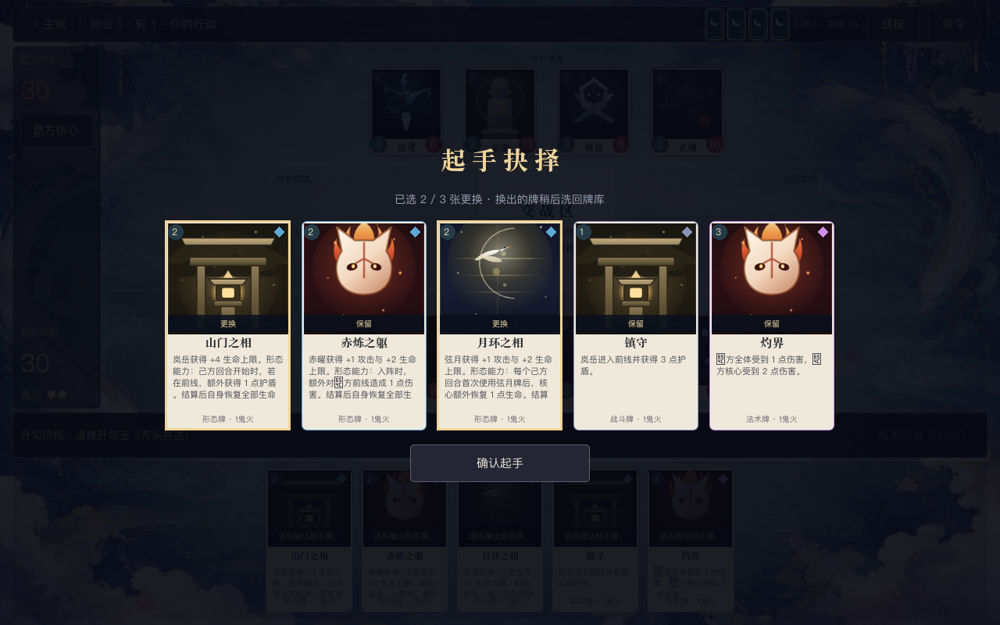
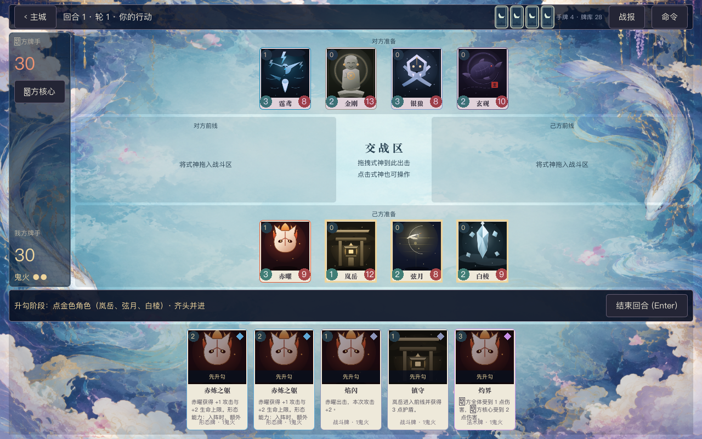
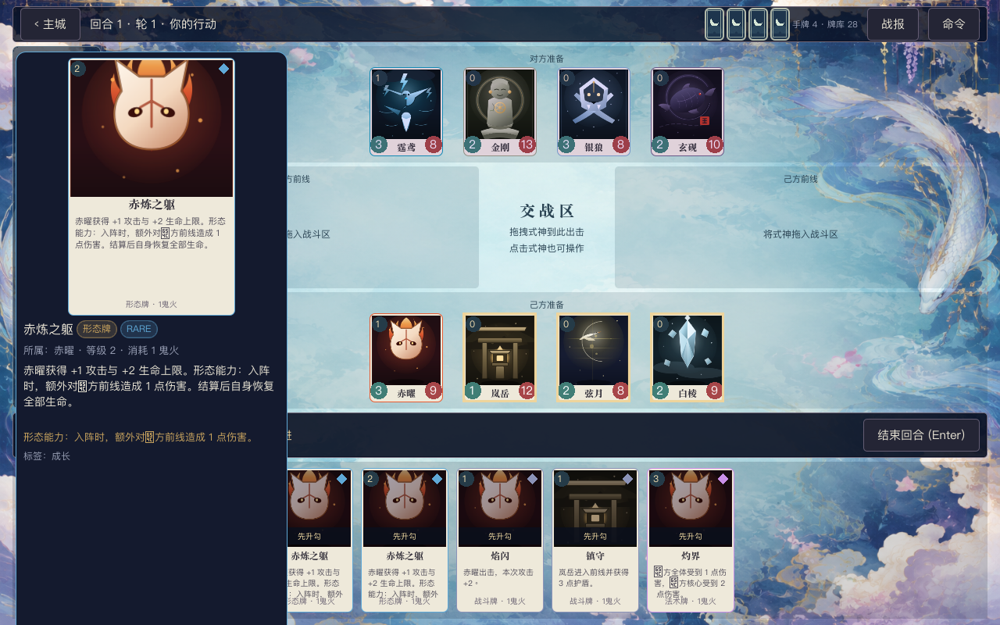

# 录像参照改造验收 · 2026-10-04

本次在 `godot/` 实现可操作的主城、编组、角色/卡牌展示、购买/抽卡和完整 4v4 对战流程。原工作区改动已保留，修改前副本与验证记录在 `baseline/`。

## 实际完成

主城改为月夜港口，编组采用名录、四式神、横向专属牌、八张构筑和角色档案。五个阵容槽可独立保存，构筑往返保留当前草稿。式神录支持搜索与资料包筛选，构筑使用真实加减按钮和同名数量限制。

秘闻阁按资料包购买 1/5/10 卷。购买扣款进入库存，开包消耗库存并持久化固定的五张结果；逐张翻开、全部揭晓、领取和中途离开后继续均已接通。翻卡幂等，动画期间重复输入不会销毁活动节点。缺少史诗档的资料包向上转为 SSR，概率显示与实际抽取一致。

对局加入最多三张起手替换，换出的卡在抽取替换牌后洗回；规则验证不会让无效输入改变手牌或 RNG。快速对战为完整 4v4。战场包含上下准备区、中央交战、左侧核心与鬼火、对手背面手牌、底部手牌与结束回合。拖拽和点选都通过规则合法性检查，选目标时高亮肖像，悬停显示大卡与完整牌文；AI 每个决策之间留出展示时间，升勾、伤害、气绝、回合与抽牌有独立反馈。

Botcf Image（`gpt-image-2.5`）生成并接入四张 1536×1024 环境图。角色未在本轮生成，继续使用项目现有 SVG；补齐了 Godot 侧对已有资料片资源的引用。美术素材与生成原图映射见 [资产记录](../../godot/assets/scenery/README.md)，风格与原提示词见 [art-direction.md](art-direction.md)、[art-prompts.txt](art-prompts.txt)。视频观察见 [video-analysis.md](video-analysis.md)。

## 验证证据

| 检查 | 本次结果 | 记录 |
| --- | --- | --- |
| `./scripts/godot-verify.sh` | 全部通过，未出现脚本错误；UI 15 个脚本、原交互 30 项、新流程 186 项 | [verify-final.log](verify-final.log) |
| 完整新流程 | 实际起手确认按钮→逐决策 4v4→结果页完整命令日志→奖励一次→返回主城 | 同上，`REFERENCE_WORKFLOW_OK` |
| 多局压测 | 60 随机 + 20 响应/占卜对局全部结束，0 卡死 | 同上，`PLAYTEST_OK` / `FOCUS_OK` |
| JS 测试 | 163 / 163 通过 | [npm-test.log](npm-test.log) |
| UI 静态审计 | 385 检查，0 errors | [audit.log](audit.log) |
| JS / Godot 规则对拍 | 7 个样本、59 个步骤全部一致 | [parity-final.log](parity-final.log) |
| 原生图形截图 | 15 张 1280×800 截图；主城、编组、构筑、式神录、商店、背面/部分/全部揭晓、换牌、检视、交战、响应、占卜、结果 | [capture-final.log](capture-final.log) |
| `git diff --check` | 通过 | 本地执行 |

检查与截图使用独立临时存档，未覆盖玩家原有阵容、卡组或收藏。无界面测试的 dummy window 会在启动时回到 64px，因此布局测试在进入战场前明确设置 1280×800，并检查实际控件尺寸和手牌边界；原生图形窗口另行截图确认。

## 界面预览

## 当前边界

本次覆盖录像展示的界面与游玩闭环，环境风格向原版靠近。角色仍是占位美术，后续可沿同一资产入口替换。Godot 原有复杂关键词与被动的简化结算继续保留，具体见 `godot/README.md`；这次未把整个卡库升级为完整原版规则。桌面窗口最小 1280×800，本轮截图与布局验收使用该尺寸，未验证移动端导出。

运行：`/Users/thysummer/apps/Godot.app/Contents/MacOS/Godot --path godot`。
